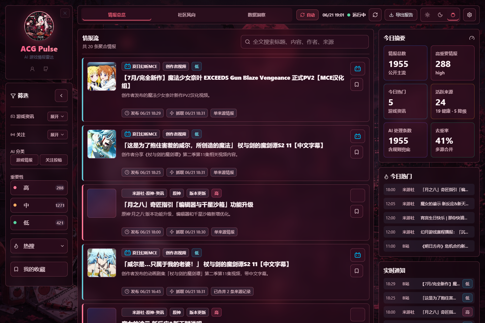
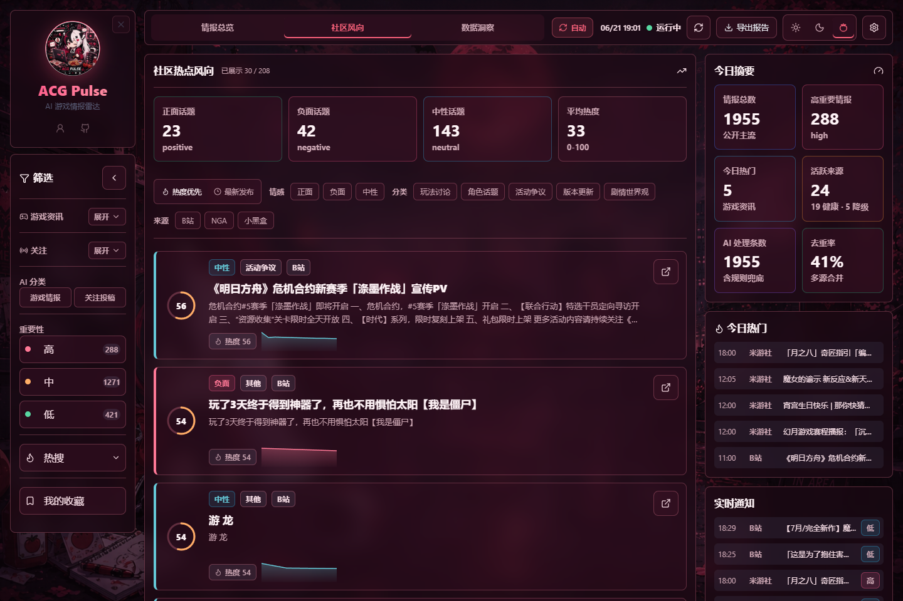
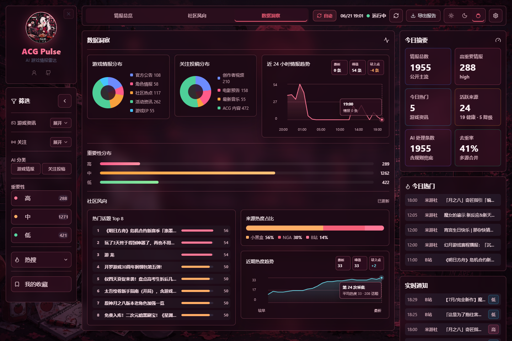
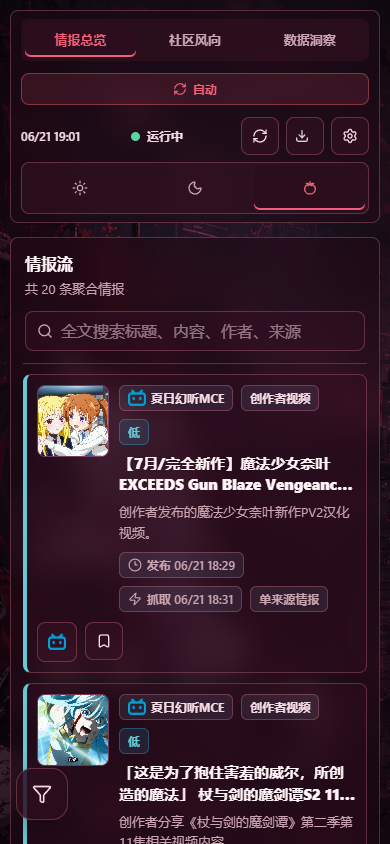
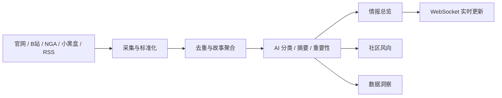

<div align="center">
  

  # ACG Pulse

  **AI 驱动的游戏与 ACG 情报聚合面板**

  从多源采集、故事聚合到社区风向与数据洞察，把分散资讯整理成可持续追踪的情报流。

  [在线体验](https://acg.yingzhu.xyz) · [快速部署](#快速开始) · [部署文档](docs/deployment-guide.md) · [问题反馈](https://github.com/yingzhu77/ACG-Pulse/issues)

  [](https://github.com/yingzhu77/ACG-Pulse/actions/workflows/ci.yml)
  
  
  
</div>



## 为什么做 ACG Pulse

游戏资讯散落在官网、社区、视频平台和 RSS 中。ACG Pulse 将这些来源统一采集，用 AI 完成分类、摘要和重要性判断，再按故事与话题组织，减少重复浏览和信息遗漏。

- **面向读者**：集中查看重要更新、热门话题和实时通知。
- **面向研究者**：比较来源占比、情绪变化和热度趋势。
- **面向维护者**：通过后台查看数据源健康、容量、API 延迟与分析队列。

## 核心能力

| 能力 | 说明 |
| --- | --- |
| 多源采集 | 聚合 B站、米游社、NGA、小黑盒、官网、RSSHub 等 24+ 数据源 |
| AI 分析 | 支持 OpenRouter、DeepSeek、Xiaomi MiMo，完成分类、摘要和重要性判断 |
| 故事聚合 | 将多来源重复内容合并为一个故事，同时保留原始出处 |
| 社区风向 | 提供情感、分类、来源筛选，以及热度与时间排序 |
| 数据洞察 | 展示情报分布、来源占比、热门话题和近期趋势 |
| 运维监控 | 监控容量、SQLite/WAL、API P95、错误率、数据源和分析队列 |

## 界面预览

| 社区风向 | 数据洞察 |
| --- | --- |
|  |  |

<div align="center">
  
  <p><sub>移动端响应式布局与快捷筛选入口</sub></p>
</div>

## 工作流程



## 技术栈

| 层级 | 技术 |
| --- | --- |
| 前端 | React 19、Vite 7、Tailwind CSS 4、Framer Motion、Lucide |
| 后端 | Node.js、Express 5、Prisma、SQLite、Socket.IO |
| AI | OpenRouter、DeepSeek、Xiaomi MiMo |
| 采集 | RSSHub、Axios、Cheerio、Playwright Chromium |
| 部署 | Docker Compose |

## 快速开始

### Docker Compose（推荐）

要求：Git、Docker 与 Docker Compose。

```bash
git clone https://github.com/yingzhu77/ACG-Pulse.git
cd ACG-Pulse

cp .env.production.example .env
```

编辑 `.env`，至少设置：

```dotenv
AI_PROVIDER=deepseek
DEEPSEEK_API_KEY=your_api_key
DEEPSEEK_MODEL=deepseek-v4-flash
ADMIN_PASSWORD=your_strong_password
ADMIN_JWT_SECRET=your_random_secret_at_least_32_chars
CLIENT_URL=http://localhost:3001
TRUST_PROXY_HOPS=0
```

检查配置并启动：

```bash
bash scripts/check-config.sh .env
docker compose up -d --build
```

访问 [http://localhost:3001](http://localhost:3001)。B站数据源建议在后台设置 Cookie，以降低匿名请求被限流的概率。

### 本地开发

先启动 RSSHub：

```bash
docker compose up -d rsshub
```

分别启动后端和前端：

```bash
cd server
npm install
PORT=3002 ADMIN_PASSWORD=local-dev ADMIN_JWT_SECRET=local-dev-secret-at-least-32-characters npm run dev
```

```bash
cd client
npm install
npm run dev
```

访问 [http://localhost:5173](http://localhost:5173)。

## 常用配置

| 变量 | 是否必填 | 用途 |
| --- | --- | --- |
| `AI_PROVIDER` | 是 | `openrouter`、`deepseek` 或 `mimo`；生产默认 `deepseek` |
| Provider API Key | 是 | 与所选 Provider 对应的密钥；默认使用 `DEEPSEEK_API_KEY` |
| `DEEPSEEK_MODEL` | 否 | DeepSeek 模型名，默认 `deepseek-v4-flash` |
| `ADMIN_PASSWORD` | 是 | 管理后台登录密码 |
| `ADMIN_JWT_SECRET` | 是 | 管理令牌签名密钥，至少 32 字符 |
| `CLIENT_URL` | 是 | 允许访问 API 的前端 Origin |
| `BILIBILI_COOKIE` | 否 | 提升 B站采集稳定性 |
| `MAX_FEED_ITEMS` | 否 | 情报保留上限，默认 2000 |
| `REPORT_TIMEZONE` | 否 | 日报/周报日期边界时区，默认 `Asia/Shanghai` |

完整配置参见 [.env.production.example](.env.production.example)。不要提交真实密码、API Key 或 Cookie。

## 验证

```bash
cd server && npm test && npm run build
cd ../client && npm run lint && npm run build
```

CI 会在推送和 Pull Request 时运行项目验证。

## 文档导航

| 文档 | 用途 |
| --- | --- |
| [部署指南](docs/deployment-guide.md) | 生产部署、反向代理与更新流程 |
| [部署排障](docs/deployment-troubleshooting.md) | 构建、容器、配置与数据迁移问题 |
| [Agent 协作手册](docs/AGENT_WORKFLOW.md) | 任务输入、开发流程、验证与提交规范 |
| [路线图](docs/ROADMAP.md) | 当前阶段和后续方向 |
| [踩坑记录](docs/LESSONS.md) | 已验证的问题模式、根因和处理规则 |
| [架构决策](docs/DECISIONS.md) | 长期技术选择及变更入口 |

## 项目结构

```text
client/                 React 前端
server/                 Express API、采集、AI 与数据库
shared/                 前后端共享类型
rsshub/                 RSSHub 浏览器运行环境
scripts/                配置检查、备份与维护脚本
docs/                   部署、协作、决策与项目记录
```

## 参与贡献

欢迎通过 Issue 报告问题或提出建议。提交代码前请阅读 [CONTRIBUTING.md](CONTRIBUTING.md)，安全问题请按 [SECURITY.md](SECURITY.md) 私下报告，不要直接创建公开 Issue。

## 致谢

- 项目早期基于 [liyupi/yupi-hot-monitor](https://github.com/liyupi/yupi-hot-monitor) 改造，感谢原作者提供的基础思路与实现
- [DIYgod/RSSHub](https://github.com/DIYgod/RSSHub)：RSS 路由与内容聚合基础设施
