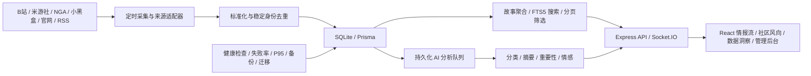

# ACG Pulse 项目案例与简历素材

> 本文用于整理简历、作品集和面试表达。所有指标均来自代码、架构决策或 2026-08-17 生产快照，不虚构用户量、QPS、AI 准确率或商业结果。

## 一句话介绍

ACG Pulse 是一个面向游戏与 ACG 内容的多源情报聚合系统，统一采集 B站、米游社、NGA、小黑盒、官网与 RSS 等 24+ 数据源，通过稳定身份去重、故事聚合、AI 分类摘要、社区热度与情感分析，将分散资讯整理为可检索、可追踪、可运维的实时情报流。

## 项目定位

- 项目类型：个人全栈项目 / 数据采集与 AI 应用工程。
- 核心场景：聚合分散资讯、降低重复阅读、追踪社区热点与来源健康。
- 技术栈：React 19、TypeScript、Vite、Tailwind CSS、Node.js、Express 5、Prisma、SQLite、Socket.IO、RSSHub、Docker Compose、Caddy。
- AI 接入：DeepSeek、OpenRouter、Xiaomi MiMo，支持显式 Provider 切换。
- 部署环境：阿里云 ECS、Ubuntu 24.04、Docker Compose、Caddy 自动 HTTPS。

## 系统架构



## 可直接用于简历的版本

### 项目描述

独立构建并部署 ACG Pulse 游戏情报聚合平台，接入 24+ 官网、视频与社区来源，完成采集、去重、AI 分析、故事聚合、社区风向、全文检索、实时更新和运维监控的完整链路；项目在 2 GB 级 ECS 上容器化运行，并针对 SQLite、外部接口风控和 AI 服务失败设计降级与恢复机制。

### 核心成果

- 设计多源适配器与定时采集流程，统一接入 B站、米游社、NGA、小黑盒、官网和 RSSHub；通过来源健康日志、并发限制、超时和回退链路定位上游风控与路由故障。
- 将内容身份与 AI 分类解耦，使用稳定 `identityKey` 和数据库唯一约束解决外部 ID 格式漂移、分类变化导致的重复入库；以 Story 聚合多来源重复报道并保持分页边界稳定。
- 构建持久化 AI 分析队列，支持任务幂等、原子 Claim、重试、失败保留和多 Provider 切换；采集成功后内容立即入流，AI 额度耗尽或请求失败不会阻塞资讯入库。
- 使用 SQLite FTS5 实现标题、正文、作者和来源全文搜索，修复触发器升级与深分页召回问题；将 Stories facets 从重复查询改为单次聚合、有界缓存与并发去重，真实数据冷请求由约 225–390 ms 降至约 123–125 ms，缓存命中约 9 ms。
- 实现 B站、NGA、小黑盒的来源内热度归一化与社区情感状态建模，区分展示排名分和原始趋势分；采用 stale-first 返回策略，避免社区冷刷新阻塞页面 30–60 秒。
- 使用 Docker Compose 部署应用和自建 RSSHub，以 Caddy 提供 HTTPS 和反向代理；补齐健康检查、生产 Prisma migrate、SQLite 备份校验、配置预检和 CI 验证流程。

## 精简版简历条目

适合简历空间有限时使用：

```text
ACG Pulse｜个人全栈项目
React 19 / TypeScript / Express 5 / Prisma / SQLite / Socket.IO / Docker

• 构建 24+ 游戏与社区数据源的采集、标准化和健康监控链路，通过稳定 identityKey、唯一约束与 Story 聚合解决重复入库和跨来源重复展示。
• 设计持久化 AI 分析队列，实现幂等入队、原子 Claim、失败重试和多 Provider 切换，使 AI 额度或服务故障不阻塞内容抓取入流。
• 基于 SQLite FTS5、单次聚合和有界缓存优化搜索与筛选，Stories 冷请求由约 225–390 ms 降至约 123–125 ms，缓存命中约 9 ms。
• 使用 Docker Compose + Caddy 部署，完善健康检查、生产迁移、备份恢复和 CI；生产实例连续稳定运行约 6 周。
```

## 生产证据

2026-08-17 到期前快照：

- 应用容器健康运行约 6 周，RSSHub 容器健康运行约 2 周。
- 生产库保留上限为 2,000 条 FeedItem。
- 最近 24 小时入库 71 条，最近 7 天入库 299 条。
- 最新内容在检查前约 12 分钟入库，证明定时采集没有整体停止。
- 最近四轮日志显示每轮检查 24 个来源，其中 10–11 个来源因 Bilibili 风控或 RSSHub 故障失败。
- AI 社区情感接口持续返回 HTTP 402，但内容采集仍能入库，验证了“采集与 AI 分析解耦”的降级设计。
- 生产数据库和部署档案均完成 SHA256 校验，SQLite `PRAGMA integrity_check` 返回 `ok`。

这些数字适合描述工程规模和稳定性，不应被包装成用户增长、业务转化或高并发指标。

## 最值得讲的技术决策

### 1. AI 不能成为采集链路的单点故障

早期直觉容易把“抓取、AI 分析、展示”串成同步流水线，但第三方模型存在额度、限流和格式波动。项目最终采用：

- 抓取成功后立即持久化 FeedItem。
- 独立 AnalysisTask 持久化队列异步补齐分析。
- pending 或 failed 分析不阻止内容公开展示。
- 任务通过去重键保证幂等，使用条件更新完成原子 Claim。
- 失败任务保留错误、重试次数、Provider 和耗时，支持后台观察与重试。

生产 AI 402 事件证明该边界有效：分析降级，但资讯仍持续入库。

### 2. 内容身份不能依赖 AI 分类

同一稿件可能出现 BV 号、完整 URL 等不同外部 ID，AI 分类也可能在多次分析间变化。项目将身份判定放在分类之前：

- 优先抽取平台稳定 ID，如 BV、文章 ID、NGA tid。
- 其他来源使用规范化 URL 或去跟踪参数的外部 ID。
- 数据库以来源和 `identityKey` 建立唯一约束。
- AI 分类只描述内容，不参与唯一身份判断。

该设计同时解决重复入库、重复分析和分页总数漂移。

### 3. 不直接比较不同社区平台的原始热度

B站播放量、NGA 回复数和小黑盒互动量没有统一量纲。系统先按平台可获得信号计算 raw 分，再在来源内部映射为展示百分位：

- B站：播放、点赞、评论和时间衰减。
- NGA：回复数、发帖时间和新帖加权。
- 小黑盒：评论、互动/奖励、转发、话题热度、轻量负反馈和时间衰减。

展示分用于本轮排序，raw 分仅用于同一话题的历史趋势，避免制造虚假的跨平台精确比较。

### 4. SQLite 适合当前规模，但必须主动治理

项目当前单机、低并发、2,000 条内容保留上限，SQLite 能降低部署复杂度；同时补充了：

- WAL 与容量监控。
- FTS5 索引和触发器自动修复。
- 外键级联与批量写入。
- 有界缓存与并发请求去重。
- 热备、完整性校验和正式 Prisma migrate。

当写并发、公开访问量或多实例需求明显提升时，再迁移 PostgreSQL，而不是为了技术栈完整度提前增加运维成本。

## 生产事故复盘素材

### 情境

服务器即将到期，网站看起来长期没有明显更新，同时 AI API 额度已经耗尽，需要判断数据是否停止、是否迁移以及怎样保留生产经验。

### 排查

1. 通过健康接口、Docker 状态和定时任务日志确认容器及调度器仍运行。
2. 对生产数据库执行只读统计，确认最近 24 小时仍入库 71 条，最新内容距检查约 12 分钟。
3. 区分 AI 402 与来源抓取失败：AI 只影响情感和分析，Bilibili 412、直连风控、RSSHub 503/403 才是内容覆盖下降的主要原因。
4. 识别 `total=2000` 来自容量上限，而不是抓取总量停滞。

### 处置

- 备份生产 `.env`、Compose 和 SQLite 数据库并下载到本地。
- 保存源码、Git 历史、未提交补丁、容器信息、系统状态和 7 天日志。
- 导出 Caddyfile、systemd 服务和版本信息。
- 对传输文件执行 SHA256，对 SQLite 执行 `PRAGMA integrity_check`。
- 删除 Cloudflare 中指向即将回收公网 IP 的 `acg` DNS 记录，消除悬空域名风险。
- 将敏感归档加入本地 Git 排除规则，避免误提交凭据。

### 结果

在不续费服务器的前提下完整保留了可恢复数据、生产代码、部署配置和故障证据；确认系统不是整体停摆，并形成了可用于下一次迁移的恢复顺序和运维改进项。

## 面试表达

### 30 秒版本

“我做了一个游戏与 ACG 情报聚合平台，接入 24 多个官网、B站和社区来源。后端用 Express、Prisma 和 SQLite，前端用 React，AI 负责摘要和分类，但我把 AI 做成持久化异步队列，所以模型额度耗尽时不影响资讯入库。项目还处理了稳定身份去重、Story 聚合、FTS5 搜索、来源内热度归一化和 Docker/Caddy 生产部署。我实际维护了六周生产实例，并用真实故障日志验证和改进了降级、备份与监控设计。”

### 两分钟版本

“这个项目最初解决的是游戏资讯分散的问题。我把官网、B站、NGA、小黑盒和 RSS 等来源统一成 Source Adapter，定时抓取后先做标准化和稳定身份去重，再写入 SQLite。AI 分类摘要通过持久化任务队列异步执行，避免第三方模型成为主链路单点故障。展示层不是简单罗列 FeedItem，而是将重复报道聚合成 Story，并提供 FTS5 搜索、筛选、社区热度和实时更新。

工程上比较有代表性的两个问题，一个是同一内容的外部 ID 和 AI 分类会变化，我用平台稳定 ID、规范化 URL 和数据库唯一约束把身份与分类解耦；另一个是首页 facets 和深分页带来的 SQLite 压力，我通过单次聚合、有界缓存、并发去重和稳定游标候选读取优化，真实数据下冷请求从约 225–390 毫秒降到约 123–125 毫秒。

生产实例运行约六周。到期前出现内容更新感知下降，我最终确认定时抓取仍工作，主要是 Bilibili 风控和 RSSHub 失败，同时 AI 账户返回 402。由于采集和 AI 已经解耦，最近 24 小时仍入库 71 条。最后我完成数据库完整性校验、部署归档和 Cloudflare DNS 下线，留下了可恢复、可复盘的生产证据。”

## 面试追问准备

### 为什么不直接用 PostgreSQL？

当前是单机、低写并发、明确容量上限的个人项目，SQLite 能显著降低部署和备份成本。通过 WAL、FTS5、批量写入、缓存和监控已经满足当前需求；当出现多实例、写锁竞争或更高公开流量时再迁移 PostgreSQL。

### AI 失败后用户会看到什么？

内容仍能入库和展示，但分析字段可能为空或处于 pending/failed。社区情感失败使用 `unknown`，不会伪装成 neutral；后续 Provider 恢复后由队列补齐。

### 如何避免重复内容？

先用来源内稳定身份键做数据库级去重，再通过确定性 URL/外部 ID、相同标题和时间窗关键词将跨来源内容聚合成 Story。AI 分类不参与唯一身份判断。

### 如何保证迁移不会丢数据？

生产备份同时保存数据库、环境配置和 Compose；文件传输后验证 SHA256，并对 SQLite 执行完整性检查。生产 schema 使用 Prisma migration，恢复时先验证备份再执行 migrate deploy。

### 生产故障如何告警？

系统记录来源健康、最后成功时间、失败率、分析队列、SQLite/WAL 和 API 延迟。下一步应将连续多轮失败来源比例、AI 402 和无新增内容分别接入外部通知，避免只依赖人工查看后台。

## 诚实边界

- 不写“百万级数据”“高并发”“日活用户”等没有证据的描述。
- 2,000 是当前保留上限，不是累计采集量，也不是用户量。
- 24+ 表示配置的数据源规模；生产日志显示其中部分来源会受上游风控影响。
- “连续运行约 6 周”来自容器运行快照，不等于六周零故障。
- 项目早期基于 `liyupi/yupi-hot-monitor` 的基础思路改造。面试被问到来源时应主动说明，并重点解释自己完成的架构演进、稳定性治理、社区模块、性能优化和生产运维工作。

## 后续可转化成果

- 将本次复盘整理成一篇文章：从“网站不更新”到定位 AI 402、Bilibili 风控和 RSSHub 故障。
- 制作一张系统架构图和一张生产排障时间线，用于作品集页面。
- 在本地从归档数据库完成一次完整恢复演练，记录恢复时间和步骤。
- 增加外部告警和自动异地备份，将此次人工排查转化为系统能力。
- 部署新的演示环境前轮换所有生产凭据，并使用脱敏或新采集数据。

## 相关资料

- `docs/deployment-retrospective-2026-08-17.md`：生产到期与故障复盘。
- `docs/DECISIONS.md`：架构决策记录。
- `docs/LESSONS.md`：开发和部署踩坑总结。
- `docs/deployment-guide.md`：部署与恢复入口。
- `docs/API_CONTRACTS.md`：API 语义和共享 DTO 边界。
